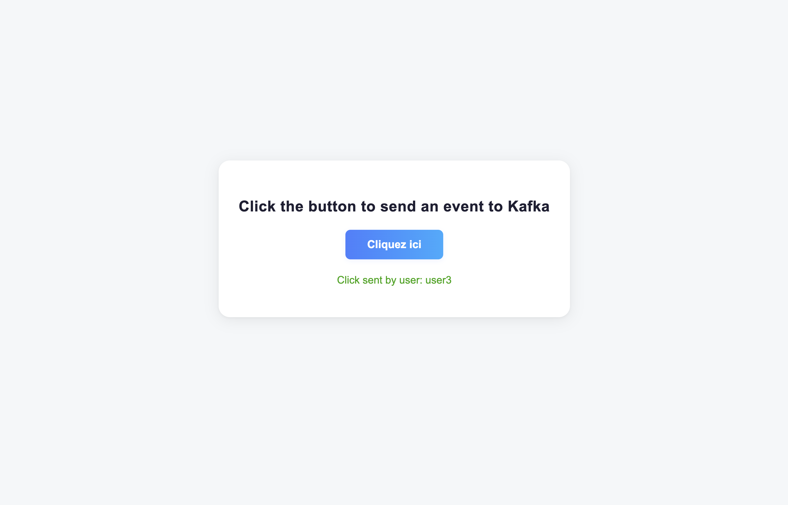
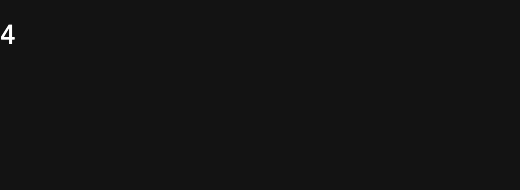
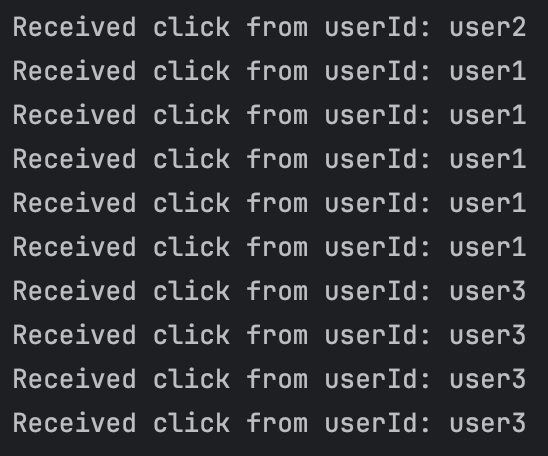

# Résultats de l'Application Counter App (Kafka Stream)

Voici quelques captures d'écran illustrant les résultats obtenus lors de l'exécution de l'application Counter App utilisant Kafka Streams.

---

## 1. Interface principale de l'application

Cette capture montre l'interface principale où l'utilisateur peut cliquer sur le bouton pour envoyer un événement à Kafka.

---

## 2. Affichage des compteurs de clics par utilisateur

Après chaque clic, le compteur de clics est mis à jour.

### Exemple : Compteur de clics pour l'utilisateur `user-1`

---

### Exemple : Compteur de clics pour l'utilisateur `user-2`

---

### Exemple : Compteur de clics pour l'utilisateur `user-3`

---

## 3. Événements en temps réel

Les compteurs de clics sont mis à jour en temps réel via Kafka Streams.

