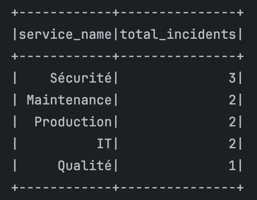
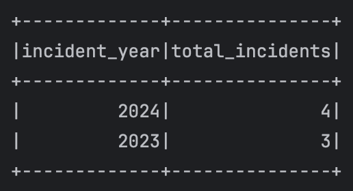

## Résultats

Voici quelques captures d'écran illustrant les résultats obtenus lors de l'exécution des requêtes Spark SQL :

### 1. Afficher le nombre d’incidents par service

Cette requête permet de visualiser le nombre total d’incidents enregistrés pour chaque service.

---

### 2. Afficher les deux années où il y avait le plus d’incidents

Cette requête extrait les deux années ayant enregistré le plus grand nombre d’incidents.

